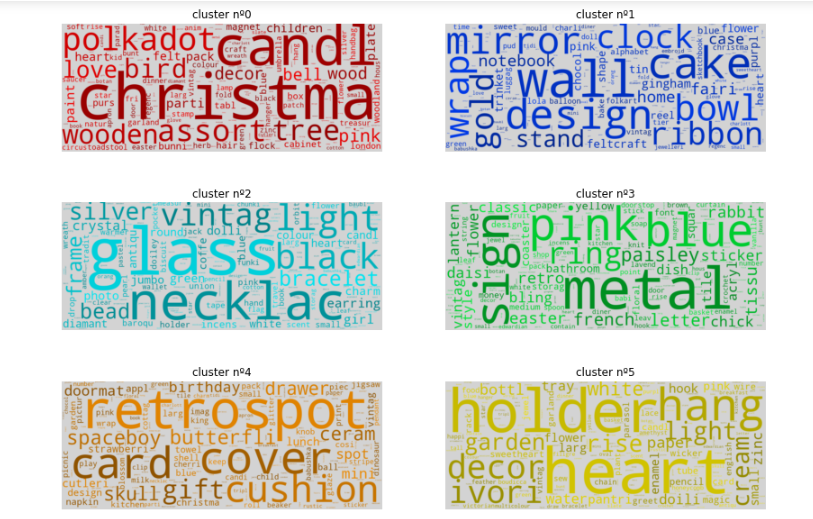
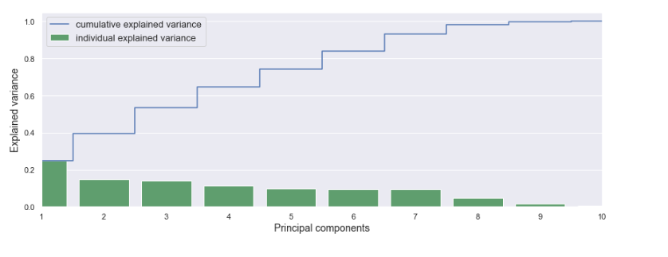
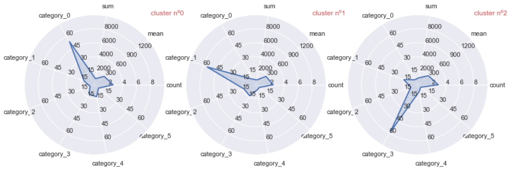

# Segmentation-for-E-commerce

Segmentaion for customers, to predict what they would but on their next visit according to their history

### Data Description
► <b>InvoiceNo </b>: Invoice number. Nominal, a 6-digit integral number uniquely assigned to each transaction. If this code starts with letter 'c', it indicates a cancellation.  
► <b>StockCode </b>: Product (item) code. Nominal, a 5-digit integral number uniquely assigned to each distinct product.  
► <b>Description </b>: Product (item) name. Nominal.  
► <b>Quantity </b>: The quantities of each product (item) per transaction. Numeric.  
► <b>InvoiceDate </b>: Invice Date and time. Numeric, the day and time when each transaction was generated.  
► <b>UnitPrice </b>: Unit price. Numeric, Product price per unit in sterling.  
► <b>CustomerID </b>: Customer number. Nominal, a 5-digit integral number uniquely assigned to each customer.  
► <b>Country </b>: Country name. Nominal, the name of the country where each customer resides. 

# First
### product Clustering

we cluster the products using tf-idf technique to get each term a score based on its importance in such product
and created matrix to be applied on `K-Means Clustering algorithms`

# Second
### Customer Clustering

We add such **product categories** through the main dataframe, such that each **Customer** got a defined **Category**
Some New Features were added to such Dataframe, such as:
  * Number of visits
  * total Cashe payed
  * Min/ Max Cashe payed 
  * Average Cashe payed

After that we Begin the Clustering with `K-Means Clustering algorithms` which ended to be `11 customer categories`

# Third
### final Dataframe
The final Dataframe will contains all information of each **Customer Cluster**
Dimensions (11,13) ::
  - 11 Clusters
  - 13 Feature (`cluster`,[`count`, `sum`, `Avg`, `min`,`max`], [`6 product category`])

Such Dataframe will be the Key for the followin Gerat Radar Visulization

Such fabulous chart indicates how **Clusters** are more to buy from such **Category** 
* Customers of **Cluster 0** are <b style="color:violet">highly biased</b> to buy products from **0 category**
* Customers of **Cluster 1** are also impressed with **category 1** products
* Customers of **Cluster 2** more to buy products from **category 3** than any other category

# Finally
### We Do the Customer Classification

models Used [`Support Vector Machine`, `Logostic Regression`,  `k-Nearest Neighbors`, `Decision Tree`, `Random Forest`, `Gradient Boosting`, `Ada Boost`]

Which Ends with ***87.38 %*** Prediction accuracy

